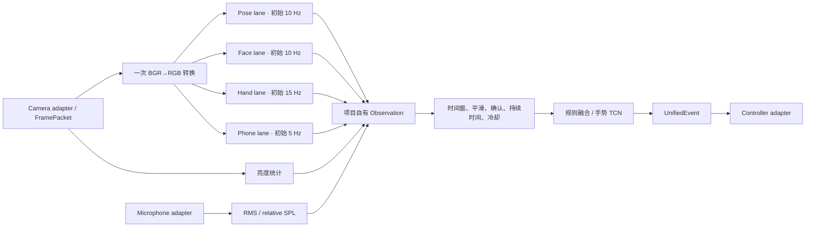

# Stage 1 感知模型选择与架构讨论稿

状态：**初选完成，目标环境验证未完成，Gate 1 未通过**

日期：2026-07-20

正式运行端：laptop CPU 基线；GPU 仅作为可选优化

## 1. 当前建议

| 功能域 | 初选 | 备选/降级 | 当前判断 |
| --- | --- | --- | --- |
| Pose | MediaPipe Pose Landmarker Full | Pose Lite | Full 先保留坐姿、局部人体的特征质量；若 P95 或总循环超预算，再以同一录像比较 Lite |
| Face | MediaPipe Face Landmarker | 无第二模型 | 单人模式；先开放 blendshapes 和 transformation matrix，实测无收益时关闭可选输出 |
| Hand | MediaPipe Hand Landmarker Full | 缺失时输出 unknown/no observation | 作为动态手势数据与部署共同使用的固定特征提取器，优先冻结 |
| Phone | MediaPipe Object Detector + EfficientDet-Lite0 int8 | 条件性比较 Lite2 或目标数据微调 | COCO `cell phone` 类已确认；目前只作为 phone evidence，不能单独确认“正在使用” |
| 环境亮度 | 图像亮度统计 | unknown | 不引入模型 |
| 环境噪声 | RMS/相对 SPL | unknown | 不引入声音分类模型 |
| Identity / YAMNet / off-task learned model | P2 延后 | 规则或不输出 | 不进入核心闭环，避免同时扩大数据、隐私和性能风险 |

“初选”只表示 API、资产、输出形态和架构位置成立。只有使用最终摄像头，完成有效率、错误行为、CPU、内存和 P95 延迟比较后，才能成为 release/fallback。

## 2. 为什么采用拆分任务，而不是一个整体感知图

Pose、Face、Hand、Phone 的目标频率、失败模式和后续消费者不同，因此采用四条独立、容量有界的最新帧通道：

- Hand 需要更高时间分辨率，且它的版本会直接决定后续手势数据格式；
- Phone 是较慢的小目标检测，可降采样，不能拖慢 Hand；
- Face 和 Pose 可按各自有效率与延迟独立降级；
- 单个组件失败时，其 observation 变为 invalid/stale，不使其他事件失效；
- 每条通道都可独立回放、比较候选和记录 P50/P95。

代价是需要统一调度、共享色彩转换并严格管理 CPU。这个复杂度是显式的，也是后续做性能预算和失败隔离所必需的。

## 3. 运行数据流



频率只是第一轮 CPU benchmark 的起点，不是冻结参数。所有 lane 使用单调时间戳和 latest-frame 语义；慢消费者覆盖旧待处理帧并累计 dropped/skipped 指标，不允许队列随运行时间增长。

## 4. 模型边界

MediaPipe result、NumPy/OpenCV 图像、框架 tensor 和设备句柄都不能越过 adapter。每个 adapter 转换为项目自有记录，至少包含：

- `source_id`、`frame_id`、单调 `timestamp_ms`；
- `valid`、`stale`、缺失掩码和失败原因；
- 归一化 observation、置信度和最小 supporting evidence；
- model/version/config 标识，供日志追踪。

录像评估使用同步、可复现的 VIDEO 路径；正式实时运行使用有界 LIVE_STREAM 路径。两者必须生成同一 observation 结构。任何异步跳帧都作为测量结果记录，不能伪装成负样本。

## 5. 各功能的判断层

### 5.1 静止与姿势

Pose 只提供带有效性的关键点。静止时间来自关键点运动量与真实时间戳；姿势先使用可解释的角度、相对位置和校准规则。只有规则在跨用户/桌椅条件下有明确失败证据时，才启动额外姿势模型。

### 5.2 屏幕距离、头向与眨眼

Face observation 提供 landmarks、可选 blendshapes 和 transformation matrix。屏幕距离必须结合摄像头/座位标定；不能把二维脸框大小直接当作跨设备的绝对距离。眨眼率只累计有效可见时间，face 缺失或低置信度期间不计为“不眨眼”。

### 5.3 手机使用

`cell phone` 检测只生成 `phone_present_candidate` evidence。建议的确认链是：

1. phone box 在连续时间窗内有效；
2. Hand 与 phone 的空间关系支持“手持/交互”；
3. 可选 head direction 作为支持证据，而不是必要条件；
4. 经进入阈值、持续时间和冷却后，才产生 `phone_usage_detected`。

桌面上闲置手机、屏幕形状干扰物、单帧低置信度框都不能触发使用事件。阈值必须由最终摄像头的正负录像决定。

### 5.4 动态手势

Hand Landmarker 输出的 `21 × 3` landmarks 经手腕中心化、尺度归一化，并保留 handedness、时间间隔和缺失掩码，形成固定长度或时间跨度窗口。TCN 输出 `wave/swipe/circle/no_gesture/unknown` 概率；经过平滑、多帧确认和 cooldown 才产生语义事件。wave/swipe/circle 对应的机器人指令继续保持未冻结，不能写进模型标签或权重。

### 5.5 亮度与噪声

亮度使用图像统计，噪声使用麦克风 RMS/相对 SPL 和有效性标记。先避免 YAMNet，因为需求是强度阈值而不是声源类别；绝对 dB SPL 只有完成设备校准后才可声称。

## 6. 双人并行边界：从模型到事件纵向拆分

并行工作不按“一个人训练、一个人写运行时”横向拆分，而按两个完整功能域纵向拆分。每条轨道从预训练模型评测开始，独立负责自己的数据、特征、规则或训练、回放测试和语义事件候选。这样训练输入与部署预处理由同一负责人维护，避免在中间接口处反复等待。

### 6.1 轨道 A：人体工学与环境（Ergonomics）

| 层次 | 轨道 A 独占内容 |
| --- | --- |
| 预训练模型 | MediaPipe Pose Landmarker、Face Landmarker |
| 非模型输入 | 图像亮度统计、麦克风 RMS/相对 SPL |
| 功能 | `static_too_long`、`bad_posture`、`screen_too_close`、头向证据、`low_blink_rate`、亮度与噪声事件 |
| 条件训练 | 只有规则跨用户失效后才启动 Pose MLP/TCN；P0 不依赖该训练 |
| P2 扩展 | YuNet/SFace 身份、YAMNet 声音类别，由轨道 A 维护但不得阻塞 P0/P1 |
| 交付 | Ergonomics observations、事件候选、独立回放、评估报告和配置 |

轨道 A 的代码和文档前缀：

```text
src/deskmate_advance/perception/ergonomics/
src/deskmate_advance/features/ergonomics/
src/deskmate_advance/temporal/ergonomics/
configs/ergonomics/
scripts/ergonomics/
tests/ergonomics/
docs/evaluation/ergonomics-*.md
data/manifests/ergonomics-*.jsonl
```

### 6.2 轨道 B：交互与手机（Interaction）

| 层次 | 轨道 B 独占内容 |
| --- | --- |
| 预训练模型 | MediaPipe Hand Landmarker、Phone detector |
| 必须训练 | Hand landmark sequence 上的轻量 TCN：`wave`、`swipe`、`circle`、`no_gesture/unknown` |
| 功能 | `gesture_detected`、手机存在证据、`phone_usage_detected` |
| 条件训练 | 目标摄像头召回不足时微调 phone detector；规则融合失败后才训练手机使用 MLP/TCN |
| P2 扩展 | off-task 融合，由轨道 B 维护但不得阻塞 P0/P1 |
| 交付 | Interaction observations、手势模型及数据清单、事件候选、独立回放、评估报告和配置 |

轨道 B 的代码和文档前缀：

```text
src/deskmate_advance/perception/interaction/
src/deskmate_advance/features/interaction/
src/deskmate_advance/temporal/interaction/
configs/interaction/
scripts/interaction/
tests/interaction/
docs/evaluation/interaction-*.md
data/manifests/interaction-*.jsonl
```

### 6.3 并行期间只读的共享边界

以下路径不归任一轨道修改，开始并行前冻结；需要变更时记录请求，留到单人集成阶段统一处理：

```text
src/deskmate_advance/domain/
src/deskmate_advance/perception/camera/
src/deskmate_advance/events/
src/deskmate_advance/runtime/
src/deskmate_advance/integration/
configs/integration/
models/manifest.yaml
pyproject.toml
```

两条轨道只能消费共享 `FramePacket` 和版本化 observation/event 契约，不得直接导入对方的实现。轨道 A 的 `head_direction` 可以作为轨道 B 手机使用判断的可选输入，但 B 必须在该输入缺失、低置信或过期时独立降级，不能形成开发阻塞。

焦点计时器、手势到命令的映射、统一事件转换、controller adapter 和机器人动作均不属于 A/B 模型轨道；它们由最终集成人在共享运行时中实现。轨道 B 只交付手势语义及证据，不交付计时器或电机命令。

每条轨道使用自己的本地模型资产和候选记录完成实验；只有通过各自 gate 的候选，才在最终集成阶段由单一负责人写入 `models/manifest.yaml`。两人不得在并行分支上分别编辑该总 manifest。

### 6.4 单人集成阶段

两条轨道分别提交固定版本的 handoff bundle 后，停止新增功能，由一名集成人依次完成：

1. 读取两套回放 fixture，验证 schema、时间戳、有效性、缺失和 stale 语义；
2. 将两条轨道接入同一个有界调度器，但保留独立频率、队列和失败隔离；
3. 将事件候选转换为统一 `UnifiedEvent`，并保持不同事件可并行 active；
4. 合并模型资产条目、冻结离线配置并测量完整循环 P50/P95、CPU/GPU、内存和丢帧；
5. 先通过事件模拟器和录像回放，再进入 controller dry-run 和机器人安全联调。

集成人只做适配、调度、配置合并和缺陷修复，不在此阶段重新设计任一轨道的模型或标签。若 handoff 未通过契约测试，退回对应轨道修复，不在共享运行时中加入临时分支。

## 7. 环境风险与已采取措施

| 风险 | 当前措施 | 剩余风险 |
| --- | --- | --- |
| `opencv-python` 与 MediaPipe 拉取的 contrib 包同时安装 | 只保留 `opencv-contrib-python==5.0.0.93`；既有 camera tests 已通过 | 换 Python/平台时需重新建立环境测试 |
| 浮动依赖造成演示前破坏 | MediaPipe、OpenCV、sounddevice、psutil 固定版本；Python 限制 `<3.14` | 尚未生成完整传递依赖锁文件 |
| 官方 `latest` 资产可能改变 | 权重只下载一次，本地离线加载；manifest 记录大小和 SHA-256 | 更新模型必须创建新 version/hash，禁止原位覆盖 |
| 模型 bundle 许可未在已查页面中单独写明 | manifest 将框架 Apache-2.0 与模型资产许可分开，模型资产暂限本地项目评估 | 对外分发或发布前必须由人确认适用条款 |
| 最终摄像头未知 | Camera adapter 保持设备无关；laptop camera 证据只算 exploratory | 无法完成准确率、有效率、采样率和真实延迟选择 |
| 多模型争用 CPU | 独立频率、容量 1 latest-frame 通道、CPU baseline | 需要完整循环 benchmark 才能冻结频率和 Full/Lite |
| Phone 小目标/遮挡与“存在≠使用” | 检测器只给 evidence，并与 Hand/时间融合 | 必须收集最终视角下的正负样本 |
| Face/Hand 包含身份相关信息 | 原始媒体留在忽略目录；事件只保留紧凑 evidence | 数据采集仍需 consent/license 与 participant/session manifest |

## 8. 需要后续讨论但不阻塞初选的项目

1. robotics 最终摄像头的 device/transport/resolution/FPS/color/timestamp 契约；
2. Hand 是只支持一只手，还是演示场景必须支持双手；
3. Face 的 blendshapes 与 matrix 是否都保留，依据是对眨眼/头向收益和 CPU 成本；
4. Phone 使用的进入、退出、持续时间和 idle-phone 负样本验收线；
5. 每个模块的有效率、误触发、漏检和 P95 延迟门线。

在这些项目冻结前，可以继续完成 observation adapter、录像回放和 benchmark harness，但不能宣告 Gate 1 通过，也不能开始以未冻结 Hand extractor 生成正式手势训练集。
