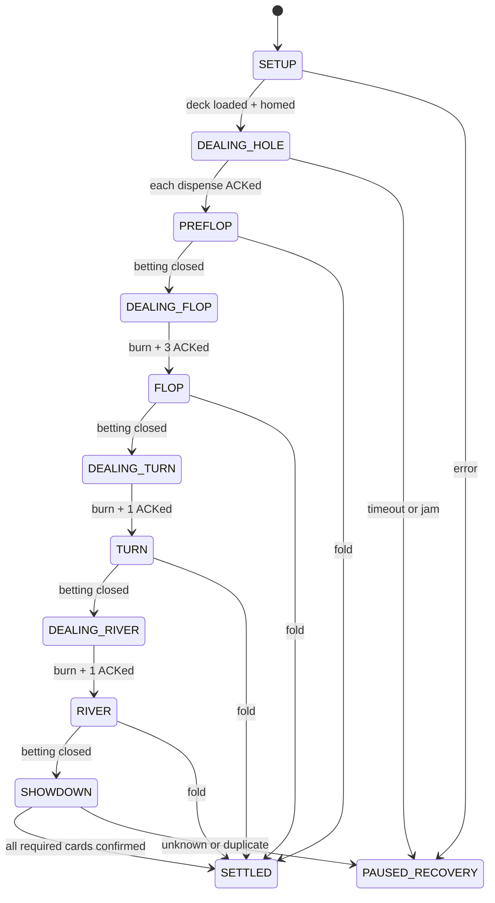

# 系统架构与文件边界

## 运行时状态所有权

`game` 是牌局事实、当前行动席位和数字账本的唯一写入者；perception 只能提交观察，robotics 只能提交命令结果，UI 只能提交玩家意图。这样可以避免“模型认为玩家已经行动或已经发牌、MCU 认为没有发牌、UI 又提前进入下一轮”的多份真相。



`PAUSED_RECOVERY` 可以从任意活动状态进入；恢复必须携带人工确认和原状态快照，不能用重新启动程序掩盖状态丢失。

## 建议目录

```text
src/poker_dealer/
  domain/              # 跨边界的纯 Python 记录；无框架/设备对象
  io/camera/           # 可复用 OpenCV 相机适配器
  game/                # 规则、状态机、牌型、账本
  perception/cards/    # ROI、几何归一化、模型、时序确认
  perception/actions/  # 当前席 action ROI、行为特征/时序模型、证据确认
  robotics/dealer/     # 语义协议、串口/USB 适配器和模拟器
  runtime/             # 单一总调度、日志、恢复
configs/
  game/                # 冻结后的规则参数
  perception/          # 相机/ROI/阈值；Stage 2 创建
  robotics/            # 槽位/超时/协议；Stage 3 创建
data/manifests/        # 源数据与 derived view 清单
models/manifest.yaml   # 唯一模型登记表，不存权重
scripts/
  camera/              # 非录制式 probe/preview
  game/                # Stage 1 模拟工具
  perception/          # Stage 2 采集、训练、评估、导出
  robotics/            # Stage 3 mock/protocol/hardware tests
  runtime/             # Stage 4/5 演示入口
tests/
  domain io game perception robotics runtime
docs/
  plans architecture contracts stages evaluation
```

## 依赖规则

- `domain` 只能依赖标准库和 NumPy 类型；不得导入 OpenCV、PyTorch 或串口库。
- `game` 可以导入 `domain.cards/actions`，不得导入 perception/robotics。
- `perception` 将 OpenCV/框架结果转换成 `CardObservation` 或 `PlayerActionObservation` 后立即丢弃框架对象。
- `robotics` 将 wire packet 转换成 `DealerAck`；MCU 的原始句柄不得进入 runtime/game。
- `runtime` 是唯一允许同时依赖 game、perception 和 robotics 的应用层。
- 测试通过 simulator 注入观察和 ACK，不以真实相机/机器人作为单元测试前提。

## 关键数据流

### 玩家行为与关注席位

`game` 从当前状态生成 `acting_seat`、`legal_actions` 和 `state_version`。runtime 用它选择一个固定 `seat_*_action_roi`，行为模型只输出该窗口的时序 evidence。非当前席动作、旧 state version、`ambiguous/occluded/out_of_roi/unknown` 或非法动作均保持原状态。只有候选通过时序/校准门槛和 game 复核后，正式 action、数字账本变化和新 state version 才能原子提交；随后才计算下一位并切换 ROI。模型无权选择下一位、修改筹码或使用人脸身份。

行为 evidence 必须与正式 `PlayerAction` 分开记录。具体手势语法和阈值由目标相机/参与者证据决定，不能由接口名称反推。

### 发牌与桌面场景

每一张物理牌的发放都使用唯一 `command_id`：game 请求目标槽，runtime 发送命令，robotics 返回匹配 ACK；只有 `succeeded` 才增加已发牌计数。重复 ACK 必须幂等，未知 `command_id` 必须拒绝。视觉识别不能代替发牌传感器 ACK；它只验证可见牌面和桌面一致性。

十三个牌槽由 game 根据牌局阶段推进 lifecycle：预期空槽、等待发牌、背面牌存在、等待揭示、正面未确认、已确认、已清空；不确定或证据冲突保持当前预期并暂停/重观察。ACK 证明物理发放，视觉证明槽位占用/朝向和可见身份，二者在要求可见牌面确认的阶段都满足后才推进。

### 账本与恢复

数字账本是唯一筹码权威；实体筹码不是观测输入。动作应用、street/hand contribution、pot layers、余额和 state version 原子更新。人工调整/rebuy 必须作为带 operator/reason 的独立事件，不能修改历史日志。

每一手牌保存 append-only hand log：规则配置版本、按钮座位、原始行为 evidence、动作接受/拒绝、命令/ACK、牌槽视觉观察、暂停/恢复、人工账本事件、最终 5 张最佳牌、赢家和账本变化。图像默认不写入 log；需要保存调试图像时必须使用明确的本地证据开关和保留策略。
