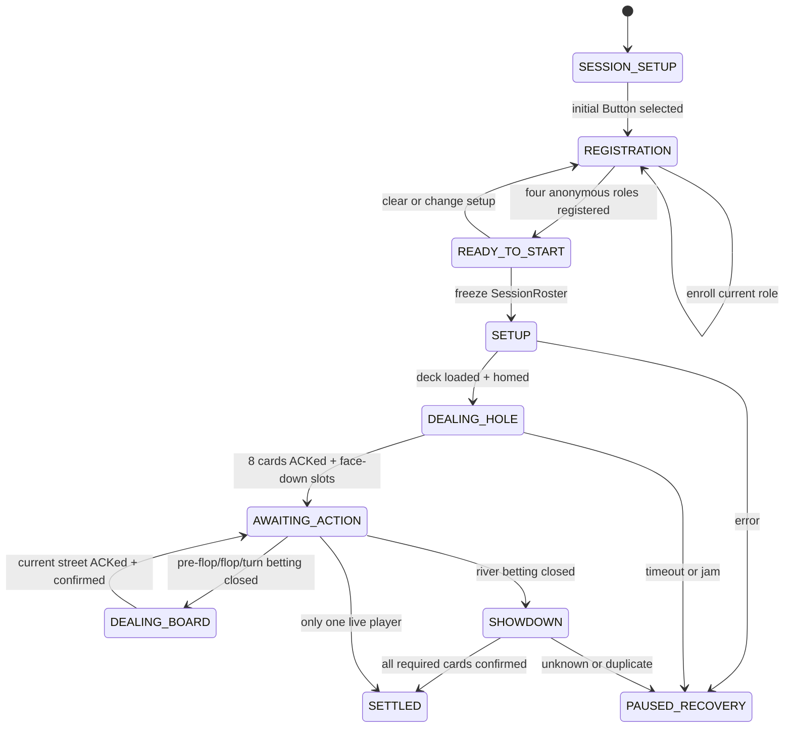
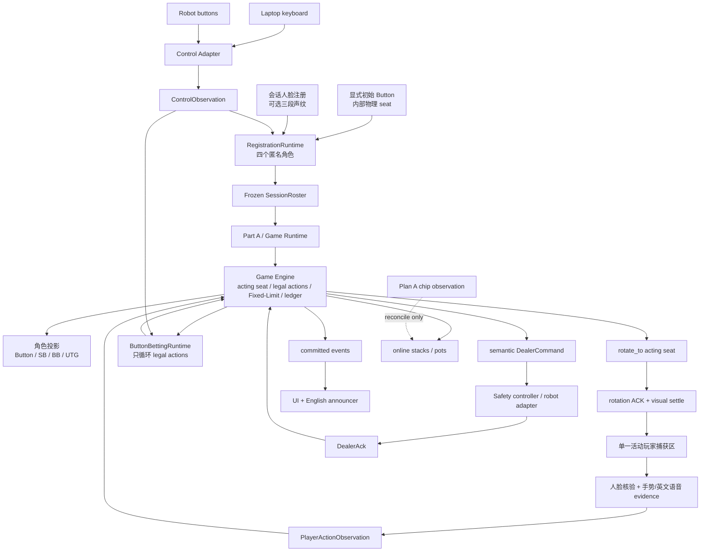

# 系统架构与文件边界

## 权威层级与 Core v1 决策

- `docs/plans/POKER_DEALER_MASTER_PLAN.md` 定义产品范围、阶段与 Gate。
- `configs/game/core_v1.json` 是四人规则、显式初始 Button、Fixed-Limit 和数字账本语义的机器可读权威。
- 本文定义软件模块、状态所有权和 Laptop/机器人替换边界，不另建一套产品规则。

Core v1 当前决定：玩家界面只使用 Button、Small Blind、Big Blind、UTG 角色；`seat_a…d` 只表示机器人可旋转到的内部物理位置，不要求玩家姓名。初始 Button 必须在每场会话显式给出，不能由第一个注册者推断。下注使用 Fixed-Limit，数字账本是唯一余额权威；Laptop 与机器人按钮共享语义输入。Plan A 的固定下注区视觉只能核对账本，Plan B 的权威实体筹码属于后续研究。

## 运行时状态所有权

`game` 是牌局事实、当前行动席位和数字账本的唯一写入者；perception 只能提交观察，robotics 只能提交命令结果，UI 只能提交玩家意图。这样可以避免“模型认为玩家已经行动或已经发牌、MCU 认为没有发牌、UI 又提前进入下一轮”的多份真相。



`PAUSED_RECOVERY` 可以从任意活动状态进入；恢复必须携带人工确认和原状态快照，不能用重新启动程序掩盖状态丢失。

代码只使用 `HandPhase` 作为上述高层状态；Pre-flop、Flop、Turn、River 是
`Street`，不是另一套 phase。`HandRuntime` 依据当前 `HandPhase` 在 Part A
与 Part B 之间切换，具体边界见
[统一手牌运行时](unified-hand-runtime.md)。

注册保持单轮流程：四个角色完成人脸注册即可冻结，不增加第二轮返回首人的验证。会话人脸和可选声纹只用于状态机已经选定角色的身份核验，embedding 仅存在内存；它们不决定 Button、acting seat、合法动作或筹码。声纹注册由明确的三段进度引导，三段接纳后自动结束，也可由控制输入取消。

## 建议目录

```text
src/poker_dealer/
  domain/              # 跨边界的纯 Python 记录；无框架/设备对象
  io/camera/           # 可复用 OpenCV 相机适配器
  game/                # 规则、状态机、牌型、账本
  perception/cards/    # ROI、几何归一化、模型、时序确认
  perception/identity/ # 本场匿名人脸核验；embedding 仅在内存
  perception/actions/  # 转向后的活动玩家窗口、行为时序证据确认
  robotics/dealer/     # 语义协议、串口/USB 适配器和模拟器
  runtime/             # 单一总调度、日志、恢复
configs/
  game/                # 冻结后的规则参数
  perception/          # 相机/ROI/阈值；Stage 2 创建
  robotics/            # 槽位/超时/协议；Stage 3 创建
data/manifests/        # 源数据与 derived view 清单
models/manifest.yaml   # 唯一模型登记表，不存权重
scripts/
  camera/              # 非录制式 probe/preview
  game/                # Stage 1 模拟工具
  perception/          # Stage 2 采集、训练、评估、导出
  robotics/            # Stage 3 mock/protocol/hardware tests
  runtime/             # Stage 4/5 演示入口
tests/
  domain io game perception robotics runtime
docs/
  plans architecture contracts stages evaluation
```

## 依赖规则

- `domain` 只能依赖标准库和 NumPy 类型；不得导入 OpenCV、PyTorch 或串口库。
- `game` 可以导入 `domain.cards/actions`，不得导入 perception/robotics。
- `perception` 将 OpenCV/框架结果转换成 `CardObservation` 或 `PlayerActionObservation` 后立即丢弃框架对象。
- `robotics` 将 wire packet 转换成 `DealerAck`；MCU 的原始句柄不得进入 runtime/game。
- `runtime` 是唯一允许同时依赖 game、perception 和 robotics 的应用层。
- 测试通过 simulator 注入观察和 ACK，不以真实相机/机器人作为单元测试前提。

## 关键数据流

### 总体纵向闭环



这张图有三条不能反转的边界：模型 observation 不能直接推进 game；按钮只能从 game 给出的合法动作中选择，不能直接写账本；播报器只消费已提交事件，不能反向控制状态机。机器人版本只替换 camera/control/dealer adapter，不替换注册、规则、账本或事件语义。

### 会话注册与角色投影

1. Laptop 参数或未来机器人设置流程显式指定哪个内部 `seat_*` 当前承载 Button。
2. `RegistrationRuntime` 根据顺时针关系投影 Button、Small Blind、Big Blind、UTG，并以角色引导单轮注册。
3. 内部只分配 `participant_1…4` 供本场内存 gallery 匹配；UI、播报和玩家操作不要求姓名。
4. 四角色完成后，`start` 冻结 `SessionRoster`，随后加载 Part A；冻结名单不能被迟到的人脸或声纹结果修改。
5. 正常结算后由 game 顺时针移动 Button，下一手角色随之重投影，不重新命名玩家。

### Laptop 与机器人控制输入

`ControlObservation` 统一 `confirm/cancel/start/clear/next_option/previous_option`。Laptop 键盘只是 fallback；未来机器人按钮 adapter 产生同样的 observation ID、单调时间、source 和 device state version。Wire transport、GPIO 或 MCU 不得直接调用 gallery、game reducer 或账本。

注册阶段的 `confirm/start/clear` 只交给 `RegistrationRuntime`。正式下注阶段的按钮选择必须进入 `HandRuntime/Part A` 已建立的当前角色窗口；`next/previous` 只能在 game 给出的 `legal_actions` 内循环，`confirm` 仍需经过当前 hand/state/acting-seat 门禁。`ButtonBettingRuntime` 的直接 game 提交仅供显式 opt-in 的 Laptop pilot 使用，不能作为产品入口。Fixed-Limit 金额由 game 配置推导，按钮不上传任意金额。

### 玩家行为与关注席位

`game` 从当前状态生成 `acting_seat`、`legal_actions` 和 `state_version`。runtime 请求机器人 `rotate_to` 该内部物理目标，只有旋转 ACK 和新画面稳定后才打开单一活动玩家捕获区；产品不假设四名玩家同时出现在一个摄像画面，也不根据画面位置猜 seat。会话人脸先核验预期注册者，手部必须归属到该目标人物，行为模型随后只输出该窗口的时序 evidence。多脸、错人、多手归属不清、旧 state version、`ambiguous/occluded/out_of_roi/unknown` 或非法动作均保持原状态。只有候选通过身份/归属、时序/校准门槛和 game 复核后，正式 action、数字账本变化和新 state version 才能原子提交；随后才计算下一位并请求下一次转向。模型无权选择下一位或修改筹码；会话人脸/声纹只能核验状态机已经选定的角色，不能转移注意力或账本。

行为 evidence 必须与正式 `PlayerAction` 分开记录。具体手势语法和阈值由目标相机/参与者证据决定，不能由接口名称反推。

### 发牌与桌面场景

每一张物理牌的发放都使用唯一 `command_id`：game 请求目标槽，runtime 发送命令，robotics 返回匹配 ACK；只有 `succeeded` 才增加已发牌计数。重复 ACK 必须幂等，未知 `command_id` 必须拒绝。视觉识别不能代替发牌传感器 ACK；它只验证可见牌面和桌面一致性。

十三个牌槽由 game 根据牌局阶段推进 lifecycle：预期空槽、等待发牌、背面牌存在、等待揭示、正面未确认、已确认、已清空；不确定或证据冲突保持当前预期并暂停/重观察。ACK 证明物理发放，视觉证明槽位占用/朝向和可见身份，二者在要求可见牌面确认的阶段都满足后才推进。

### 账本与恢复

数字账本是 Core 唯一筹码权威。Laptop 或机器人按钮提交的合法动作与 street/hand contribution、pot layers、余额和 state version 原子更新，并持续展示线上筹码。Plan A 可以把固定下注区的实体筹码作为 `observed_chip_units` 核对证据；不一致只能暂停或请求确认，不能覆盖账本。Plan B 才研究托盘、称重或 RFID 等权威实体筹码方案，不能阻塞 Core。人工调整/rebuy 必须作为带 operator/reason 的独立事件，不能修改历史日志。

### UI 与事件播报

UI 和英文播报只订阅 runtime/game 已提交事件：注册角色、声纹注册进度、盲注、当前行动角色、动作接纳、street、暂停和恢复。模型 candidate、低置信观察和未确认按钮选择不得播报成既成事实。播报失败不会推进或阻塞 game；安全/恢复提示可以提高优先级，但仍不拥有状态。

每一手牌保存 append-only hand log：规则配置版本、按钮座位、原始行为 evidence、动作接受/拒绝、命令/ACK、牌槽视觉观察、暂停/恢复、人工账本事件、最终 5 张最佳牌、赢家和账本变化。图像默认不写入 log；需要保存调试图像时必须使用明确的本地证据开关和保留策略。
