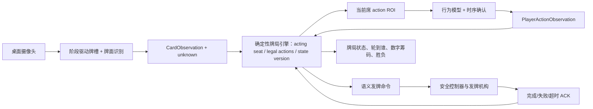
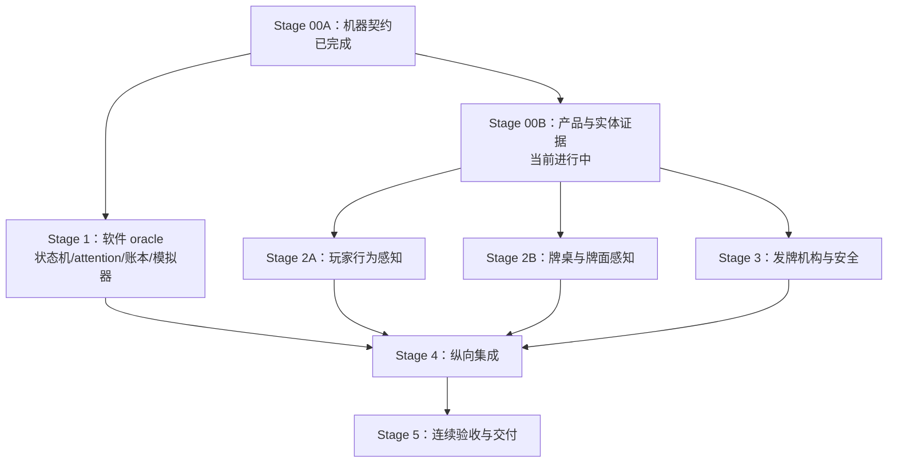

# Poker Dealer Core v1 总体计划

状态：`Stage 1 软件 oracle 工程与测试完成 / Fixed-Limit 产品确认、模型阈值与硬件证据开放`

产品负责人：团队共同确认

软件运行端：Laptop

机器人形态：桌面中央、固定底座、可定向的单张发牌机构

## 1. 产品定义

Poker Dealer 是一个真正依赖物理执行的德州扑克机器人荷官，而不是“摄像头软件加一个外壳”。它必须同时维护牌局规则、观察桌面、控制每一次发牌动作，并在不确定时停下来让人恢复。

Core v1 的一句话目标：四名玩家围绕固定桌面，由 Robot Dealer 完成 hole/burn/board 发牌；确定性状态机控制当前玩家注意窗口，行为模型确认玩家动作证据，牌面模型确认桌面牌槽，系统维护多层数字底池并确定性结算胜负。

## 2. Core 与 Plus 边界

| Core v1 必须完成 | Plus，不能阻塞 Core |
| --- | --- |
| 4 个固定玩家席位，Button/SB/BB/UTG 分离 | 2/3 人动态缩桌或 5–6 人扩展 |
| 冻结一种数字下注结构；当前候选 Fixed-Limit | 第二种下注模式与实体筹码计数 |
| 人工洗牌、装牌 | 自动洗牌 |
| 自动单张发底牌、burn、公共牌；reveal 方式待 S0-13 | 自由空间收牌、整理牌 |
| 冻结 fold/check/call/bet/raise 语义；状态机选当前席 ROI，时序模型只发 evidence | 让模型决定轮到谁、动作合法性或账本变化 |
| 固定座位和固定牌槽 | 无约束桌面检测/跟踪 |
| 识别正面朝上的公共牌和摊牌 | 读取仍盖住的底牌 |
| 确定性规则、牌型和胜负 | 用模型“判断”规则或胜负 |
| 数字筹码账本唯一权威；实体筹码若摆放仅为非权威道具 | 实体筹码识别、自动收取、分拣和支付 |
| 人工回收上一手牌 | 自动回收牌 |

## 3. 核心闭环

只有当前席位行为 evidence 经时序/校准确认、版本和合法性复核并与账本原子提交后，状态机才切换到下一席 ROI。牌桌阶段只在所需视觉证据和 ACK 到齐后推进。行为 `ambiguous/occluded/unknown`、牌面 `unknown`、重复牌、非法动作、发牌超时、卡牌堵塞、断连或状态不一致都保持当前预期或进入 `PAUSED_RECOVERY`，不允许猜测后继续。

## 4. 技术职责边界

| 模块 | 唯一职责 | 明确不负责 |
| --- | --- | --- |
| `game` | 规则、轮次、合法动作、下注账本、牌型与奖池分配 | 摄像头、模型、马达 |
| `perception/actions` | 当前席固定 ROI、行为特征/时序证据、校准与拒识 | 选择 acting seat、动作合法性、筹码 |
| `perception/cards` | 牌槽占用、rank/suit、置信度、unknown、证据 | 胜负、下注、发牌 |
| `robotics/dealer` | 语义命令传输、ACK、超时、模拟器 | 牌局规则、模型 |
| Robotics MCU | homing、角度/速度、传感器、互锁、急停、堵塞保护 | 牌局推进 |
| `runtime` | 协调模块、持久化 hand log、暂停与恢复 | 偷改各模块判定 |
| UI/action input | 展示状态、提交玩家动作、人工恢复确认 | 直接驱动马达 |

## 5. 为什么第一步不是选预训练模型

行为模型输入取决于手势语法、当前席 action ROI、玩家距离/遮挡和确认交互；牌面模型输入取决于摄像头位置、牌槽、牌面尺寸、光照、牌副设计和摊牌方式。机械输出又取决于发牌机构和传感器。如果先选模型，数据和接口很可能在硬件/交互冻结后重做。因此顺序是：

1. Stage 0 冻结游戏与机械/视觉契约。
2. Stage 1 先建立无摄像头、无机器人的规则 oracle 与模拟闭环。
3. Stage 2 才在目标相机和目标牌桌证据上选择/训练模型。

预选方向不是最终录取：玩家行为先比较固定 ROI 上的规则基线、hand/upper-body landmarks + compact TCN，只有 landmark 失败证据充分才比较小型 RGB 时序模型；具体手势尚未冻结。牌面使用固定 ROI + 几何归一化找牌角，并预选 ImageNet 预训练 MobileNetV3-Small 双头分类器输出 13 个 rank 和 4 个 suit；固定槽定位实测失败后才启动轻量 detector。

## 6. 阶段总览

| 阶段 | 主要产物 | Deep Learning 侧 | Robotics 侧 | Gate |
| --- | --- | --- | --- | --- |
| 0 合约冻结 | 四人、行为 evidence、牌槽 lifecycle、命令、账本与验收合同 | action/card schema 已迁移；阈值/相机证据开放 | 10-target 语义已迁移；机构/reveal/传感器实证开放 | Fixed-Limit、模型证据与硬件 Gate 开放 |
| 1 软件 oracle | 游戏引擎、牌型 evaluator、数字账本、全模拟器 | 构造行为/牌槽 replay 与错误注入接口 | 构造命令/ACK 模拟器 | 无硬件完成整手牌与注意力切换 |
| 2 行为与牌面感知 | 两类数据集、候选比较、模型、离线 replay | 主要训练阶段 | 提供目标桌面/相机/光照夹具 | 当前席动作和牌面均高精度确认、低置信拒识 |
| 3 发牌机构 | feeder、旋转定位、传感器、控制协议 | 提供相机观测/发牌验证工具 | 主要机械、电控与固件阶段 | 单卡、定位、卡堵与急停通过 |
| 4 纵向集成 | runtime、幂等握手、暂停恢复、日志 | 稳定观测与视觉健康状态 | 稳定命令执行与故障 ACK | 录制回放后再真人低速联调 |
| 5 验收演示 | 可重复完整牌局、报告、操作手册 | 指标和失败样例冻结 | 安全检查和机构寿命结果 | 连续多手无非法状态/危险动作 |

四人版建议节奏：Stage 0 产品/行为交互/纸模收口约 4–7 天；Stage 1 因状态机、注意力门控和 side pots 约 1.5–2 周；Stage 2 的行为与牌面两条感知子轨约 3–4 周，并与 Stage 3 的 2–3 周机构工作并行；Stage 4 约 1.5–2 周；Stage 5 约 3–5 天。时间是规划量级，不代表跳过 Gate 的日期承诺。

### 6.1 依赖与并行关系

Stage 1 的不依赖实体证据部分现在即可开始；Stage 2A、2B 和 Stage 3 在各自的 Stage 00B 子 Gate 通过后并行。Stage 4 是第一次要求 Gate 1、2A、2B、3 全部到齐的汇合点。任何子轨不能为了赶集成而绕过自己的录取 Gate。

### 6.2 阶段入口、出口和当前状态

| 阶段 | 入口条件 | 出口证据 | 当前状态 |
| --- | --- | --- | --- |
| 00A 契约 | 四人 Core 范围确认 | rules v1.2、S0-01…20、schemas、18 walkthroughs | 已完成软件契约迁移 |
| 00B 证据 | 00A | S0-07/16/18 产品决定，目标相机/桌面/机构/安全证据 | 进行中，尚未关闭 |
| 1 软件 oracle | 00A | 可重放状态机、行为 focus、账本、牌型、三类 simulator、属性测试 | 工程实现与测试通过；Fixed-Limit adapter 为 candidate，release 总门仍受 S0-07 限制 |
| 2A 行为感知 | S0-02/16/18 子 Gate | held-out participant/session 指标、校准阈值、离线 export | Laptop 手势、英文语音及四席 ROI 路由已接入；象限只属 feasibility，真人多席矩阵、最终语法、数据 split 与目标相机 Gate 开放 |
| 2B 牌面感知 | S0-02/04/05/11/13/19 子 Gate | held-out deck/session 指标、牌槽 lifecycle replay、离线 export | 等待目标桌面/相机证据 |
| 3 发牌机构 | S0-01/03/04/09/10/13 子 Gate | 单张/落点/reveal/安全/协议实测 | 可做受控原型，不可 release |
| 4 纵向集成 | Gate 1、2A、2B、3 | 六级集成梯、故障注入、10 手 dry run、恢复报告 | 未开始 |
| 5 验收交付 | Gate 4 | 连续 20 手、独立 log replay、操作员交接、离线交付包 | 未开始 |

### 6.3 里程碑和停止条件

1. **M0：Stage 00B 签字。** 未冻结手势/确认交互、目标相机或安全证据时，不录取模型、不冻结 CAD。
2. **M1：软件闭环。** 无相机、无机器人完成整手牌；行为 evidence 只有当前席可被提升，账本与 state version 原子且可恢复。
3. **M2A/M2B/M3：三条独立子轨录取。** 模型和机构各自使用固定证据，不以现场“看起来能用”代替指标。
4. **M4：集成就绪。** 只有通过 simulator 和 recorded replay，才允许实物低速；失败回到最近单独通过的组合。
5. **M5：Core 完成。** 20 手是验收证据，不是演示时长；任何错误账本、错误赢家、未确认推进或危险动作都使本轮验收失败。

每个里程碑只允许更新自己拥有的配置、模型或机构版本；若共享 schema 改动，必须回到 Stage 00 做显式迁移，并重跑所有下游消费者测试。

### 6.4 建议迭代安排

| 迭代 | 软件/DL 主线 | Robotics/产品主线 | 结束检查点 |
| --- | --- | --- | --- |
| A：契约到薄片 | S1.0 contract harness、S1.1 state/event、S1.2 当前席 evidence→原子提交→下一席 | 00B 手势/反馈纸模、相机/table pilot、feeder/reveal bench 设计 | 一条无设备动作闭环；00B 缺口有证据/owner |
| B：软件 oracle | S1.3 ledger/pots、S1.4 evaluator、S1.5 candidate betting、S1.6/1.7 simulators/replay | 完成 S0-07/16/18 产品签字和 Stage 3 安全/协议前置 | Gate 1 子门；Stage 2A/2B/3 各自入口判定 |
| C：三轨并行 | Stage 2A 行为数据/模型/确认；Stage 2B scene/card；支持 recorded replay | Stage 3 feeder/position/reveal/MCU/safety | Gate 2A、2B、3 独立报告，不强行同日结束 |
| D：逐级汇合 | I4.1→I4.6 runtime、replay、live perception、恢复/性能 | 真实 dealer 低速与安全见证 | Gate 4、固定 RC compatibility matrix |
| E：交付 | 独立 checker、20 手 qualification、模型/日志报告 | 见证故障、操作员交接、安全/机构报告 | Gate 5 和离线交付包 |

迭代 A 是当前建议立即开始的工作：它优先证明你关心的“模型证据如何进入状态机并切换到下一玩家”，而不是继续扩展位置顺序代码。迭代 C 的三轨按各自 Gate 完成，不以最慢轨道阻塞其他轨道的离线进展。

当 DL/软件侧当前由两人并行时，Stage 2 明确拆为 A「玩家动作与多模态输入」和 B「牌桌场景与牌面识别」两条独占实现轨道；共享合同和集成文件并行期间只读，分别形成 handoff bundle 后再汇合。具体任务、文件边界、一周 Laptop 节奏和 Gate 见 [Stage 2 双人分工](STAGE2_TWO_PERSON_WORKSPLIT.md)。

## 7. 并行工作划分

Stage 0/1 后分成两条并行轨道：

- DL/软件：`domain`、`game`、`perception/actions`、`perception/cards`、两类数据/模型、软件模拟器、回放评估。
- Robotics：机构 CAD/制造、MCU、传感器、低层安全、dealer transport 模拟器与硬件验收。

双方共享但不能单方静默修改：牌槽 ID、`DealerCommand`/`DealerAck`、卡牌观察结构、手牌状态快照、错误码和 Stage 4 验收脚本。共享接口变更必须同时更新合约、双方模拟器和消费者测试。

## 8. Core 成功指标（Stage 0 待签字）

以下是建议验收线，不是已经测得的结果：

- 规则：黄金用例、非法动作和随机属性测试中 0 个非法状态推进。
- 牌型/底池：标准 5/7 张牌向量 100% 一致；main/side pots、eligibility、tie 和 odd unit 正确且资金守恒。
- 玩家行为：held-out participant/session 上报告每动作 precision/recall/F1、校准、拒识率、跨席泄漏、false accepted actions per hour/hand 和 P95 确认延迟；阈值待 pilot 冻结，原则是错误接受不能造成未拦截的账本变化。
- 牌面视觉：确认结果的 card identity precision ≥ 99.5%；达不到置信门槛时宁可 `unknown`；同一牌槽跨帧稳定；任何重复牌触发暂停。
- 发牌：连续 200 次单张测试 0 次双张；目标槽成功率 ≥ 99%；卡堵/无牌在规定超时内被检测；急停有效。
- 集成：四名玩家至少连续完成 20 手牌，覆盖 Button 轮转、多人 fold/all-in、main/side pots 和多人 showdown；0 次错误推进、0 次未确认发牌后推进、0 次危险动作。
- 性能：Laptop 离线运行，无运行时下载；交互状态更新 P95 ≤ 300 ms；牌面确认 P95 目标 ≤ 1 s。

若真实目标证据表明这些数值不合理，只能在 Stage 0/对应 Gate 通过有理由的变更记录调整，不能为通过演示临时降阈值。

## 9. 故障优先设计

| 故障 | 系统行为 | 人工恢复条件 |
| --- | --- | --- |
| 发牌命令超时/断连 | 急停发牌序列，保持当前 street | 检查机构，home，确认桌面状态 |
| 无牌/双张/堵塞 | MCU 停止并上报具体错误 | 清堵/补牌，人工确认物理牌数 |
| 视觉 unknown/遮挡 | 不登记牌面，不判胜负 | 玩家移开手/翻牌，重新观察 |
| 行为 ambiguous/遮挡/非当前席动作 | 保持当前 acting seat，状态与账本不变 | 当前玩家重做或使用已批准的确认 adapter |
| 重复 card identity | 硬错误，整手冻结 | 核对牌面/牌副/观测后人工裁决 |
| 非法玩家动作 | UI 拒绝，状态不变 | 重新选择合法动作 |
| 软件/物理状态不一致 | `PAUSED_RECOVERY` | 对照 hand log 选择恢复或作废本手 |
| 急停 | 马达失能，软件不得自动恢复 | 现场安全检查并人工复位 |

## 10. 当前冻结与未冻结

已作为 Core 合同冻结：四个固定玩家席位、位置规则、状态机唯一 acting-seat 权威、固定 action ROI 的无生物识别绑定、模型 evidence 不直接改状态、成功提交后才切换注意力、阶段驱动牌槽 lifecycle、Laptop 正式运行、自动发牌语义、五种动作语义、所有 live players 固定 ROI showdown、确定性多 pot 结算、数字账本唯一权威及 append-only audit；详细规则版本为 `configs/game/core_v1.json` v1.2。

仍需产品/实体证据：确认 Fixed-Limit；冻结行为手势语法、四个 action ROI、时序/校准阈值及显式确认策略；确定公共牌自动翻面或 fallback；完成 feeder、目标相机、10 个目标毫米几何、13 个牌槽 ROI、机构超时、安全/协议、目标牌副与 held-out deck/participant/session capture。1/2、2/4、cap 4、stack 80 和 30 秒只是默认配置；连续 20 手仅是冻结的验收策略。

详细决策表见 [Stage 0](../stages/STAGE_0_SCOPE_AND_CONTRACTS.md)，逐项证据见 [Gate 0 审计](../evaluation/stage-0-gate-audit.md)。Stage 1 软件 oracle 已完成并通过独立 Gate 测试；S0-07 未确认前，其 Fixed-Limit reducer 仍只能是 candidate，其他 Gate 关闭前不能录取模型、冻结正式 ROI/data split 或定版机构。

## 11. 文档入口与完成定义

- [系统架构与文件边界](../architecture/system-architecture.md)
- [共享接口](../contracts/CORE_INTERFACES.md)
- [Stage 0：范围与合约](../stages/STAGE_0_SCOPE_AND_CONTRACTS.md)
- [Stage 1：规则引擎与模拟器](../stages/STAGE_1_GAME_ENGINE_SIMULATOR.md)
- [Stage 2 双人分工与交接](STAGE2_TWO_PERSON_WORKSPLIT.md)
- [Stage 2：玩家行为与牌面感知](../stages/STAGE_2_CARD_PERCEPTION.md)
- [Stage 3：发牌机构](../stages/STAGE_3_DEALER_MECHANISM.md)
- [Stage 4：纵向集成](../stages/STAGE_4_INTEGRATION.md)
- [Stage 5：验收演示](../stages/STAGE_5_DEMO_ACCEPTANCE.md)

只有当 Stage 0–5 各自的证据和 Gate 全部通过，Core v1 才算完成。Plus 需求没有开始或没有完成，不影响 Core 的完成定义。
# S0-21 / Stage 2A 补充：本场玩家身份核验

Core 允许把本场、显式同意的人脸注册作为可选核验证据：状态机先给出 `acting_seat`，机器人完成面向该席位，视觉再输出 `player_id` 或 `unknown`。身份模型永不决定轮到谁，也不改变动作、牌局或数字筹码。embedding 仅存在内存并在退出时销毁。此能力当前是 development Pilot，最终阈值、活体、目标相机/旋转证据和恢复 UX 均未冻结，不计作 Stage 2A Gate 已通过。
