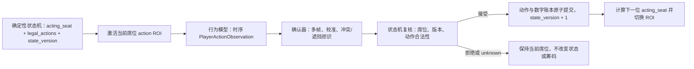

# Stage 0：四人范围、规则与物理合约冻结

当前状态：`四人位置、Fixed-Limit、状态机控制的玩家注意力、模型证据接口、牌槽生命周期和数字账本权威已冻结；行为阈值及硬件/相机证据开放`。四名玩家让 Button、SB、BB、UTG 成为独立角色；Robot 是不参与下注的实体荷官。

## 已调整的产品边界

- 四个固定玩家席位 `seat_a…seat_d`，顺时针排列；本 Core 不做动态 2–4 人桌。
- Button 每手轮转；SB、BB、UTG/首位行动和 post-flop 顺序由通用位置函数生成。
- 人工洗牌、装牌、收牌；Robot 按无烧牌流程自动发四人 hole、flop、turn、river。
- 实体筹码处理仍是 Plus；数字账本必须支持 main/side pots。
- 固定桌垫、9 个机械目标、13 个牌面视觉槽和 4 个玩家 action regions；Core 使用无烧牌流程，识别正面 board、所有 live players 的 showdown cards 和当前席行为 evidence。
- 规则、pot eligibility、最佳五张和赢家由确定性代码产生；模型只输出观察。
- 状态机是 `acting_seat` 的唯一权威，只激活当前玩家的固定 action ROI；行为模型不得自行选择下一位玩家。
- 行为模型输出带 hand/state/window 的时序证据，只有经确认、合法性复核和原子账本提交后才能切换关注席位。
- 十三个牌槽由状态机按阶段维护生命周期；机器人 ACK、槽位占用/朝向和可见牌面识别是不同证据。
- 数字账本是 Core 唯一筹码权威；实体筹码识别、收取和支付仍是 Plus。
- Fixed-Limit 已确认为 Core v1 下注结构；默认数字仍可配置。

## 从模型到下一位玩家的闭环



固定席位就是玩家绑定，不做人脸识别。非当前席位的动作只能作为负样本/干扰证据，不能生成正式动作。模型不输出下一位玩家，也不直接输出账本变化。

## 四项用户决策

| ID | 调整后状态 | 精确定义 |
| --- | --- | --- |
| S0-05 Showdown | Frozen | 所有 live players 把两张 hole cards 放到各席固定 ROIs；folded players 不评估 |
| S0-06 Action UI | Partial | `fold/check/call/bet/raise` 语义冻结；Laptop/按钮/手势/语音 adapter 可替换 |
| S0-07 Betting | Frozen structure | Fixed-Limit 已确认；1/2、2/4、cap 4、stack 80 是可配置默认 |
| S0-12 Acceptance | Frozen QA | 连续 20 手牌是质量 Gate，不是产品功能或现场演示时长 |

## 四人顺序示例

Button=`seat_a`：

```text
Button A | SB B | BB C | UTG D

Deal:      B -> C -> D -> A，重复两轮
Pre-flop:  D -> A -> B -> C
Post-flop: B -> C -> D -> A
Next hand Button: B
```

实际行动顺序跳过 folded/all-in 玩家。Role 由 Button 和 active/actionable set 推导，不能存成可能漂移的独立真相。

## 逻辑桌面

```text
                           seat_c
                         [C1][C2]

         seat_b       [F1][F2][F3][T][R]       seat_d
       [B1][B2]                                  [D1][D2]

                     guarded dealer base

                           seat_a
                         [A1][A2]
```

图只冻结 seat/slot 身份和顺时针关系，不代表最终毫米位置。Robot 玩家发牌目标为 A/B/C/D，showdown 小格由玩家主动放牌；二者不是同一个落点要求。

## S0-01…20 当前状态

| ID | 状态 | 已冻结 | 仍需解决 |
| --- | --- | --- | --- |
| 01 feeder | evidence | 中央单张、服务四席 | 分离/翻面机构与真实牌证据 |
| 02 camera | evidence | 单相机覆盖 13 card slots + 4 action regions | 型号、高度、镜头、牌面可读性和四席行为时序质量 |
| 03 targets | partial | 9 个 target IDs，无 burn target | 角度、距离、drop polygons、容差 |
| 04 board | partial | 5 个独立有序槽 | 桌垫尺寸、牌距和运动轨迹 |
| 05 showdown | frozen | 所有 live players 两张固定 ROI | 仅几何由 02/04 决定 |
| 06 action | partial | 五种动作语义和身份/版本 | 输入 adapter 与 No-Limit amount |
| 07 betting | partial | 多人 pot/all-in/守恒 | Fixed/No-Limit 产品确认；数值均可配 |
| 08 timeouts | partial | 超时暂停、不猜 success | UI 默认与机构 P95/P99 |
| 09 safety | evidence | home/jam/interlock/E-stop/watchdog | BOM、电路、stop time、见证测试 |
| 10 protocol | partial | 版本/ID/ACK/error/idempotency | framing、CRC、MCU parser |
| 11 decks | evidence | held-out deck/session、四方向 | 牌副 SKU、数量、桌垫、光照 |
| 12 acceptance | frozen QA | 连续 20 手 | Stage 5 evidence，不影响短演示 |
| 13 board reveal | evidence | board 最终 face-up、hole face-down、无 burn | flip chute、reveal board 或 manual fallback |
| 14 reset | partial | 每手恢复完整 deck 后人工洗装 | checklist 与完整牌副确认方式 |
| 15 indication | partial | 四席必须看懂 Button/SB/BB/UTG/turn | Laptop、实体灯或机器人灯光 |
| 16 behaviour perception | partial | 固定 action ROI、无生物识别、模型只发 evidence | 手势语法、相机覆盖、特征/时序模型、显式确认方式 |
| 17 attention authority | frozen | 状态机唯一决定 acting seat；提交成功后才切 ROI | 提示灯/声音/UI 外观仍可替换 |
| 18 action confirmation | partial | 多帧、校准、版本/合法性复核；不确定时不推进 | 每动作阈值、窗口、冷却、确认交互 |
| 19 table scene | partial | 13 槽位阶段生命周期；ACK 与视觉证据分离 | ROI、占用/朝向阈值、隐藏牌可见性、reveal 机构 |
| 20 ledger authority | frozen | 数字账本唯一权威；动作/人工调整均原子记录 | UI 外观；实体筹码仍为 Plus |

机器状态权威为 `configs/contracts/stage0_decisions.json`。

## 阶段拆分与执行计划

### Stage 00A：机器契约（已完成）

产物是 rules v1.3、S0-01…22、四席/9 target/13 card slots/4 action regions、`PlayerActionObservation`、`CardObservation`、hand snapshot、dealer command/ACK schemas 和 18 个合同 walkthrough。00A 只证明边界一致，不证明模型、机构或真人交互可用。

### Stage 00B：产品与实体证据（当前工作）

| 工作包 | 负责人 | 必须产出 | 通过后解锁 |
| --- | --- | --- | --- |
| 00B-P betting/interaction | Joint | S0-07 Fixed-Limit 已签字；继续冻结五种动作的手势/反馈/显式确认规则 | Stage 1 betting release、Stage 2A 采集 |
| 00B-C camera/table | DL + Robotics | 四席全景、13 card slots + 4 action regions 可用性报告，冻结相机/桌垫候选 | Stage 2A/2B pilot |
| 00B-D data design | DL | deck/session 与 participant/session manifests、标签、split 和隐私/许可方案 | 正式数据采集 |
| 00B-M mechanism | Robotics | feeder/reveal 小样、9 target 尺寸、传感器/BOM/危险区 | Stage 3 design freeze |
| 00B-X cross-contract | Joint | 纸模整手牌、focus/牌槽 lifecycle/账本/recovery walkthrough，双方 mock 互解析 | Gate 0B |

00B 允许小规模、受控、可丢弃的 pilot；不得直接生成 release 模型、正式 CAD 或现场无人运动。某个子 Gate 通过只解锁对应下游，不代表整个 Stage 00 关闭。

### Gate 0B 完成定义

- S0-07 Fixed-Limit 选择已有版本记录；S0-16、S0-18 仍需人工产品选择，数值阈值来自 pilot，而非口头约定。
- 相机候选在目标高度/光照下同时覆盖 13 个牌槽和 4 个行为区域，并记录失败区域。
- 行为 pilot 包含五种动作、长 no-action、邻席动作、取消、遮挡；牌面 pilot 包含完整 lifecycle 和四方向牌面。
- Robotics 的 feeder/reveal/安全/协议证据足以选择下一阶段候选；未解决项有明确 owner 和阻塞对象。
- 18 个 walkthrough 完成人工纸模或 mock 复核；共享 schema 在软件、DL、Robotics 三侧解释一致。
- Gate audit 明确列出通过、条件通过和未通过项；不存在“先做模型/机构、以后再补证据”的隐式批准。

## 当前允许和禁止

可以继续：四人状态机、数字账本、通用 evaluator、side-pot builder、行为/牌槽 evidence simulator；四座纸模、feeder/reveal 小样以及同时覆盖 13 个牌槽和 4 个 action ROI 的目标相机 pilot。

仍被阻塞：牌面模型录取（S0-02/11/19）、行为模型录取（S0-02/16/18）、机构 CAD 定版（S0-01/03/04/09/13）、wire protocol release（S0-10）、物理联调。Fixed-Limit reducer 不再受 S0-07 阻塞。

## Gate 0B handoff

Robotics 必须提交四座 dimensioned layout、10 目标落点试验、单张 feeder、board reveal 方案比较、传感器/BOM/安全状态图和无马达 cross-language protocol mock。DL 必须提交覆盖 13 个牌槽、四个牌方向和四个玩家 action ROI 的 target-camera 样张，包含普通动作、邻座同时动作、遮挡/取消动作以及牌角像素、反光报告，并给出 held-out deck 和 participant/session split 计划。联合必须完成完整纸模牌局、每手 reset、角色/turn 指示和模型拒识后的恢复 walkthrough。

在上述证据完成前不得声称四人 Stage 0 全部通过，不得录取模型、冻结正式 ROI 或进行无人/高速运动。
# S0-21 amendment：本场人脸身份核验

用户已明确允许一个可选的 `face detection -> embedding -> session gallery -> player_id/unknown` Pilot。该变更不撤销 S0-17：状态机仍是 `acting_seat` 唯一权威，人脸结果只能核验机器人已经转向/状态机已经选择的席位。

冻结项：显式同意、本场注册、embedding 仅在内存中、退出即清除、输出不含 embedding、`unknown/mismatch` 不推进游戏或账本。未冻结项：最终相似度和 margin、活体检测、注册 UI、目标机器人旋转视角效果、玩家换位规则以及 mismatch 人工恢复流程。详细证据要求见 [本场人脸身份核验 Pilot](../evaluation/stage2a-session-face-identity-pilot.md)，机器可读决定见 S0-21。
